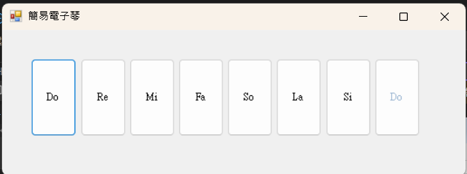

# 簡易電腦電子琴 (Beep Player)1133334楊恩奇
這是一個使用 C# WinForms 開發的趣味小工具，透過呼叫 Windows 系統底層的 kernel32.dll 中的 Beep 函式，讓電腦主機板揚聲器（或耳機）發出特定頻率的聲音，模擬鋼琴演奏。

## 核心特色
- 系統底層呼叫：使用 DllImport 技術引用 C++ Win32 API。

- 動態介面縮放：實作了自定義的比例計算邏輯，視窗放大縮小時，琴鍵會自動按比例調整大小與位置。

- 事件聚合：所有琴鍵共用同一個事件處理器，透過 TabIndex 識別音高。

## 音階對照表
程式內建 C 大調音階頻率（單位：Hz）：

Do: 523 | Re: 587 | Mi: 659 | Fa: 698

Sol: 784 | La: 880 | Si: 988 | 高音Do: 1046

## 技術實作
自動布局邏輯：

在程式載入時 (Load) 使用 Dictionary 紀錄控制項原始位置與大小。

在視窗大小改變時 (SizeChanged)，動態計算寬高比率 (iRatio) 並重新繪製控制項。

多執行緒注意事項：Beep 函式是同步執行的（會阻塞 UI 執行緒），程式中透過暫時禁用 (Enabled = false) 來防止使用者連點造成聲音排隊延遲。

## Screenshots

